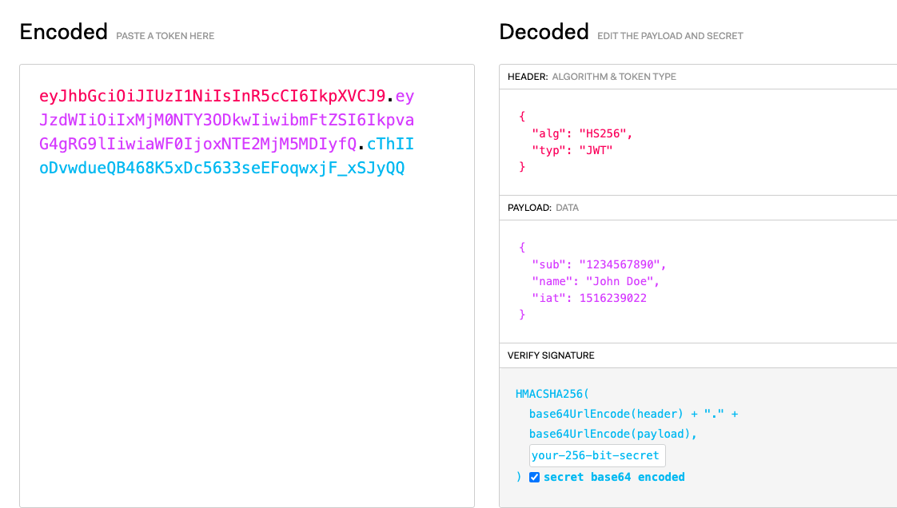

# 登录鉴权
> 用户通过用户名密码在客户端登陆到服务器，服务器拿到用户登陆数据后去查询后台数据库，把对比结果返回给服务端，服务器再把返回结果返回给客服端

- 鉴权： 基础鉴权、session/cookie、JWT、Oauth

- 算法加码：Base64、MD5/SHA-1、DES/AES、RSA/ECC

- HTTPS：SSL、HTTP劫持、数据篡改、中间人
  

## 一、常见的鉴权方式优缺点
### 1. session/cookie

优点：易扩展、简单

缺点：安全性低、跨平台困难

### 2. JWT
优点：易扩展、安全、跨平台

缺点：刷新与过期处理、Payload不易过大、中间人攻击

### 3. Oauth（微博）
优点：开放、安全

缺点：需增加授权服务器

## 二、什么是JWT
> 一种开放标准，以数字签名的方式生成JSON对象在各方之间安全地传输信息，该信息可以被验证和信任，常用于用户登录授权

JWT由**Header、Payload、Signature**三部分组成，中间以(.)连接，例如：*xxxxx.yyyyy.zzzzz*

学习资料：
https://juejin.im/post/6873700061000237069